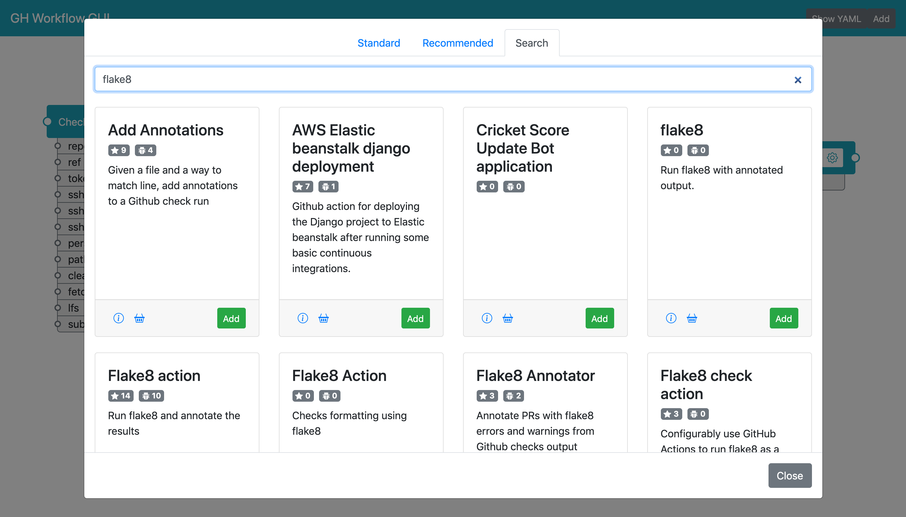
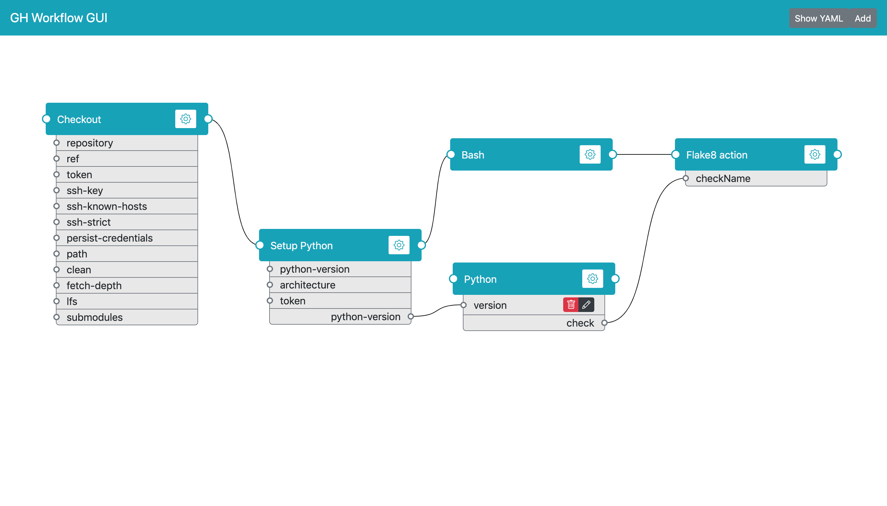
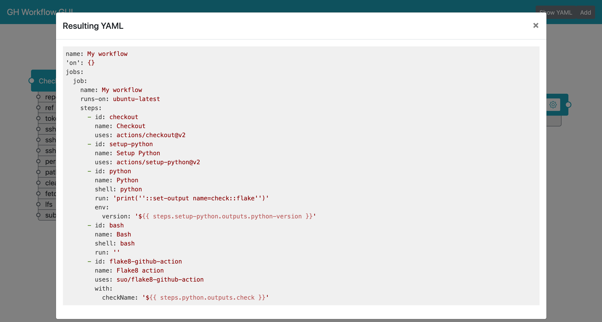

# GH Workflow GUI

This is a prototype for a GUI editor for Github workflows, originally written for the
[DEV Actions Hackathon](https://dev.to/devteam/announcing-the-github-actions-hackathon-on-dev-3ljn).
It allows you to "compose" a Github workflow in a graphical flow-like interface.

## Features

Some stuff that is implemented and works:

* Searching for and adding actions as steps
* Moving steps around and deleting them
* Connecting/disconnecting steps and their inputs/outputs
* Adding custom input environment variables
* Editing Bash and Python scripts (and detecting `::set-output` in those)
* Getting the result as YAML

Some stuff that isn't done, but should be:

* Importing an existing workflow
* Better search
* Editing workflow triggers
* Multiple jobs
* Input expression editor
* Various bugfixes and cleaner code (well, it's a hackathon after all, right?)
* Me actually learning how to properly combine Vue/TypeScript so that `npm run build` works

## Screenshots

First you need to find and some actions:



Then you have to connect them (note the manually created input environment variable and automatically
detected output variable on the Python step):



And done, you can now "collect" your YAML:



## Project setup
```
npm install
```

### Compiles and hot-reloads for development
```
npm run serve
```

### Compiles and minifies for production
```
npm run build
```
